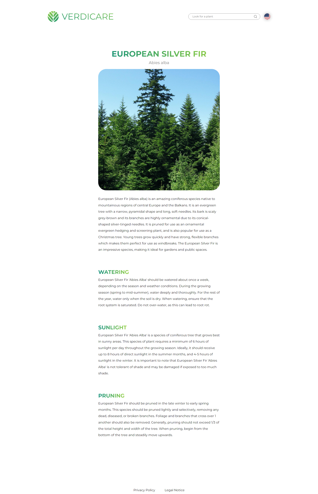
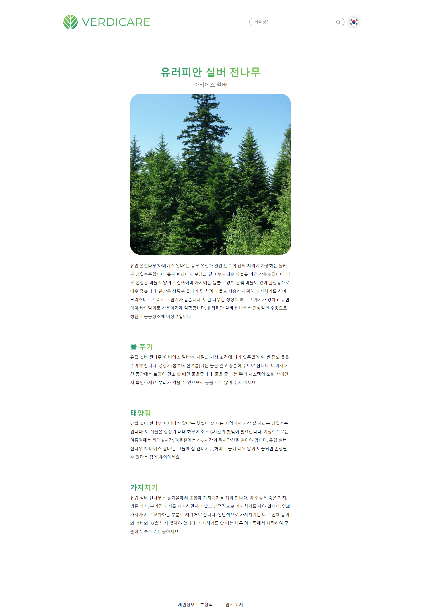

# Verdicare
This is an API-based React/Express app I built for practice. On the main screen
you can search for plants and when you click on one, it takes you to a more detailed
view with a description and a care guide. It features automatic reloading when entering
something into the search bar, when changing the language or when scrolling to the end
of the page (load more).

## Scripts
The project is divided into a frontend and a backend section, so the scripts are
in two separate package.json files. To either the frontend or the backend, you
first need to create a .env file right next to the .env.sample and fill in the necessary
information. To do this you require an API key from Perenual and from DeepL.
```
react-start
```
This starts a development server for the React frontend. When running this, the backend
also needs to be running so that the backend can fetch information from it. When using
the frontend dev server with the backend server, you need to install a browser plugin
that enables cross-origin resource sharing (CORS) or else you browser will block
the frontend's requests to the backend.
```
react-build
```
This builds the frontend and places it in the right position in the backend folder.
```
express-start-dev
```
This starts the backend development server without having to compile the typescript files
first. You need to build the React frontend first even when just using the api from
the backend.
```
express-build
```
This compiles the backend typescript for deployment.
```
express-start
```
This starts the built backend with node. You need to build first.
## Deployment
For deployment follow these steps:
1. Enter production values into both .env files
2. Build the frontend
3. Build the backend

The files you need to deploy are the following:
- /backend/public/**/*
- /backend/routes/**/*.js
- /backend/server.js

When these files are in place, you should be able to start the server.js file with Node.

## Demo
If you just want to look at the website a bit, here are some screenshots:

### Search Page In English


### Search Page Translated (To Korean)


### Details Page In English


### Details Page Translated (To Korean)
